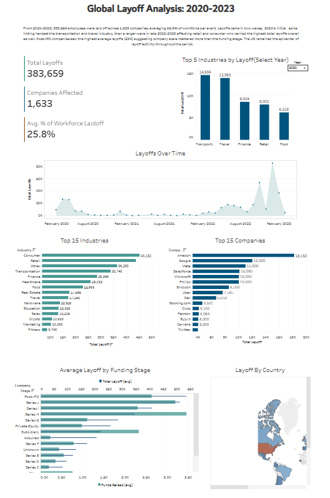

# Global Layoffs Analysis (2020–2023)

An end-to-end data analysis project exploring global layoffs from 2020 to 2023, covering data cleaning, exploratory data analysis (EDA), and an interactive Tableau dashboard.

🔗 **[View the Interactive Dashboard on Tableau Public](https://public.tableau.com/app/profile/ayesha.zahir/viz/Layoffs_17837884809660/Dashboard1?publish=yes)**




## Project Overview

This project uses a global layoffs dataset (2020–2023) to explore workforce reductions across industries, companies, funding stages, and geography. The workflow followed three stages:

1. **Data Cleaning** using MySQL Workbench
2. **Exploratory Data Analysis (EDA)** using SQL
3. **Interactive Dashboard** built in Tableau Public


## 1. Data Cleaning

Using MySQL Workbench, the raw dataset was cleaned and standardized before analysis. Key steps included:

- Removing duplicate records
- Standardizing inconsistent text values (e.g., company names, industry labels)
- Handling and filling null values where appropriate
- Verifying and correcting data types (dates, numeric fields)


## 2. Exploratory Data Analysis (EDA)

After cleaning, SQL was used to explore patterns in the data and validate insights before building visuals — including:

- Total layoffs and workforce impact by year
- Identifying which industry was hit hardest each year (using window functions to rank industries by total layoffs per year)
- Comparing average layoffs by company funding stage
- Verifying industry classifications for top companies (e.g., confirming Amazon, Google, and Meta fall under different industry categories rather than a single "Tech" label)

See[Exploratory Data Analysis](Exploratory%20Data%20Analysis.sql) for the full set of exploratory queries.


## 3. Interactive Dashboard

The cleaned and explored data was brought into **Tableau Public** to build an interactive dashboard, including:

- **KPI summary tiles:** Total layoffs, companies affected, average % of workforce laid off
- **Layoffs over time:** Trend line showing the 2020, 2022 and 2023 waves
- **By Industry** and **Top Companies:** Ranked breakdowns of impact
- **By Country:** Geographic distribution of layoffs
- **Average Layoffs by Funding Stage:** Comparing layoff scale against company funding raised
- **Top 5 Industries by Year:** An interactive year-filtered view highlighting how the hardest hit industry shifted annually

🔗 **[View the Interactive Dashboard on Tableau Public](https://public.tableau.com/app/profile/ayesha.zahir/viz/Layoffs_17837884809660/Dashboard1?publish=yes)**


## Key Insights

From 2020–2023, 383,659 employees were laid off across 1,633 companies, averaging 25.8% of workforce per event. Layoffs came in two waves, 2020's initial spike hitting hardest the Transportation and Travel industries, then a larger wave in late 2022–2023 affecting Retail and Consumer, which carried the highest total layoffs overall as well. Post-IPO companies saw the highest average layoffs (534), suggesting company scale mattered more than funding stage. The US remained the epicenter of layoff activity throughout the period.


## Tools Used

- **MySQL Workbench** Data cleaning and exploratory analysis
- **Tableau Public** Interactive dashboard design and publishing


## Repository Structure

```
├── README.md
├── Exploratory Data Analysis.sql
├── Data Cleaning_1_Removing Duplicates.sql
├── Data Cleaning_2_Standardizing Data.sql
├── Data Cleaning_3_Null and Blank Values.sql
├── Laidoff_data.csv
└── Layoff-Dashboard.png
```
